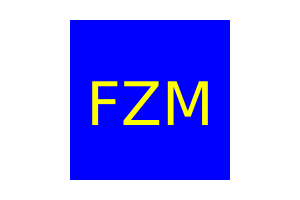

# SVG_Logo_Maker
  -------------------
  ## Badges
  -------------------
    
  ## Table of Contents  
  ----------------------
  - [Description](#description) 
  - [Usage](#usage)  
  - [Installation](#installation)
  - [Samples-and-links](#samples-and-links)      
  - [Contributing](#contributing)  
  - [Questions](#questions)
  - [License](#license)
    

  ## Description  
  -------------------
  This application generates an icon as a svg file that has three text characters and can be a square, triangle or circle based on user preference. 
  The application also includes test suites run by jest for the shape classes 

  ## Usage  
  ------------
  Run node index.js on the command line and answer prompts on shape, text color and background color and a .svg file will be created based on the answers to the prompts
 
  ## Installation  
  -------------------
  Runs on nodejs. Clone repo to your machine and run `npm i` in the command line to install json dependencies for inquirer and jest. 

  ## Samples-and-links
  -------------------
  This is a sample of an icon created by this app:

  

  [Click here to see a video of application in use](https://drive.google.com/file/d/1GBiPxkluZhTKVdQPhRKj0VjHyv4FDX3-/view?usp=sharing)

  ## Credits 
  ------------------
  I used resources learned from Rice University Coding Bootcamp as well as documentation from nodejs, inquirer and SVG. I also consulted MDN docs.

  ## Tests
  ------------------
  Run `npm test` in the command line to run the attached test files

  ## Contact Information
  -------------------------
  ### Github: [Phillip Pfister](https://github.com/phil-pfister)
  ### Email: salshouse@gmail.com

  
  ## License 
-------------- 
This application uses the The Unlicense license
  

